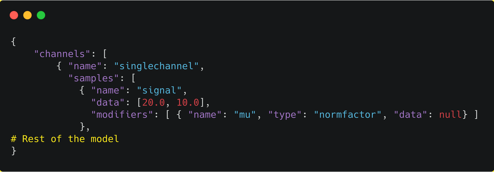
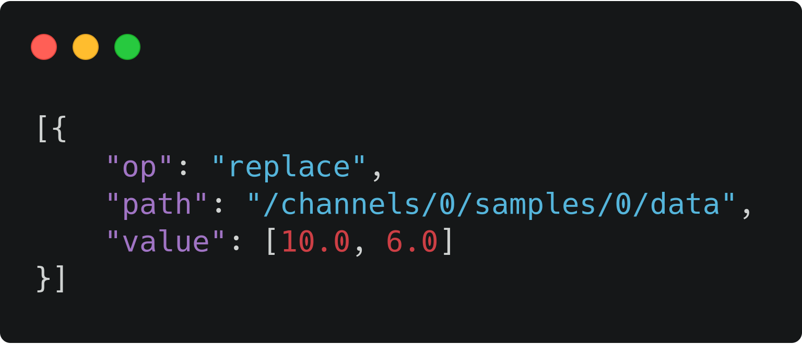
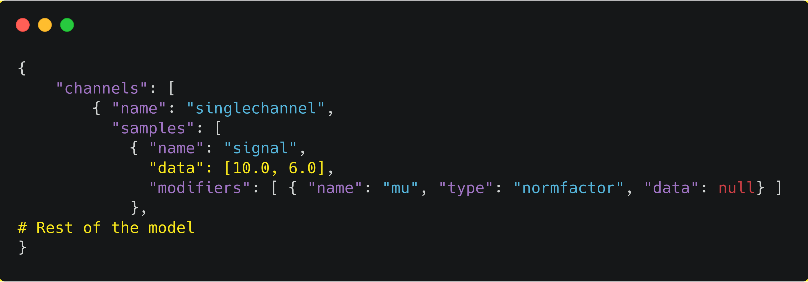
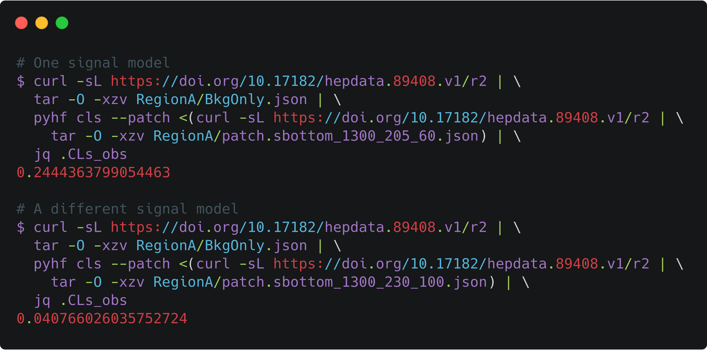

class: middle, center, title-slide
count: false

# Likelihood Publication and Preservation

 

.huge.blue[Matthew Feickert] 
.huge[(University of Illinois at Urbana-Champaign)]
.center.width-30[] 
 
[matthew.feickert@cern.ch](mailto:matthew.feickert@cern.ch)

[Snowmass 2021 Computational Frontier Workshop](https://indico.fnal.gov/event/43829/contributions/193820/)

August 10th, 2020

---
# Why is the likelihood important?

.kol-1-2.width-90[
 
- High information-density summary of analysis
- Almost everything we do in the analysis ultimately affects the likelihood and is encapsulated in it
   - Trigger
   - Detector
   - Systematic Uncertainties
   - Event Selection
- Unique representation of the analysis to preserve
]
.kol-1-2.width-100[
  

]

---
# Likelihood serialization...

.center[...making good on [19 year old agreement to publish likelihoods](https://indico.cern.ch/event/746178/contributions/3396797/)]

.center.width-90[

]

.center[([1st Workshop on Confidence Limits, CERN, 2000](http://inspirehep.net/record/534129))]

.bold[This hadn't been done in HEP until now]
- In an "open world" of statistics this is a difficult problem to solve
- What to preserve and how? All of ROOT?
- Idea: Focus on a single more tractable binned model first

---
# Example pyhf JSON spec

.center[<a href="https://carbon.now.sh/?bg=rgba(255%2C255%2C255%2C1)&t=seti&wt=none&l=application%2Fjson&ds=false&dsyoff=20px&dsblur=68px&wc=true&wa=true&pv=3px&ph=1px&ln=false&fl=1&fm=Hack&fs=14px&lh=133%25&si=false&es=4x&wm=false&code=%257B%250A%2520%2520%2520%2520%2522channels%2522%253A%2520%255B%2520%2523%2520List%2520of%2520regions%250A%2520%2520%2520%2520%2520%2520%2520%2520%257B%2520%2522name%2522%253A%2520%2522singlechannel%2522%252C%250A%2520%2520%2520%2520%2520%2520%2520%2520%2520%2520%2522samples%2522%253A%2520%255B%2520%2523%2520List%2520of%2520samples%2520in%2520region%250A%2520%2520%2520%2520%2520%2520%2520%2520%2520%2520%2520%2520%257B%2520%2522name%2522%253A%2520%2522signal%2522%252C%250A%2520%2520%2520%2520%2520%2520%2520%2520%2520%2520%2520%2520%2520%2520%2522data%2522%253A%2520%255B5.0%252C%252010.0%255D%252C%250A%2520%2520%2520%2520%2520%2520%2520%2520%2520%2520%2520%2520%2520%2520%2523%2520List%2520of%2520rate%2520factors%2520and%252For%2520systematic%2520uncertainties%250A%2520%2520%2520%2520%2520%2520%2520%2520%2520%2520%2520%2520%2520%2520%2522modifiers%2522%253A%2520%255B%2520%257B%2520%2522name%2522%253A%2520%2522mu%2522%252C%2520%2522type%2522%253A%2520%2522normfactor%2522%252C%2520%2522data%2522%253A%2520null%257D%2520%255D%250A%2520%2520%2520%2520%2520%2520%2520%2520%2520%2520%2520%2520%257D%252C%250A%2520%2520%2520%2520%2520%2520%2520%2520%2520%2520%2520%2520%257B%2520%2522name%2522%253A%2520%2522background%2522%252C%250A%2520%2520%2520%2520%2520%2520%2520%2520%2520%2520%2520%2520%2520%2520%2522data%2522%253A%2520%255B50.0%252C%252060.0%255D%252C%250A%2520%2520%2520%2520%2520%2520%2520%2520%2520%2520%2520%2520%2520%2520%2522modifiers%2522%253A%2520%255B%2520%257B%2522name%2522%253A%2520%2522uncorr_bkguncrt%2522%252C%2520%2522type%2522%253A%2520%2522shapesys%2522%252C%2520%2522data%2522%253A%2520%255B5.0%252C%252012.0%255D%257D%2520%255D%250A%2520%2520%2520%2520%2520%2520%2520%2520%2520%2520%2520%2520%257D%250A%2520%2520%2520%2520%2520%2520%2520%2520%2520%2520%255D%250A%2520%2520%2520%2520%2520%2520%2520%2520%257D%250A%2520%2520%2520%2520%255D%252C%250A%2520%2520%2520%2520%2522observations%2522%253A%2520%255B%2520%2523%2520Observed%2520data%250A%2520%2520%2520%2520%2520%2520%2520%2520%257B%2520%2522name%2522%253A%2520%2522singlechannel%2522%252C%2520%2522data%2522%253A%2520%255B50.0%252C%252060.0%255D%2520%257D%250A%2520%2520%2520%2520%255D%252C%250A%2520%2520%2520%2520%2522measurements%2522%253A%2520%255B%2520%2523%2520Parameter%2520of%2520interest%250A%2520%2520%2520%2520%2520%2520%2520%2520%257B%2520%2522name%2522%253A%2520%2522Measurement%2522%252C%2520%2522config%2522%253A%2520%257B%2522poi%2522%253A%2520%2522mu%2522%252C%2520%2522parameters%2522%253A%2520%255B%255D%257D%2520%257D%250A%2520%2520%2520%2520%255D%252C%250A%2520%2520%2520%2520%2522version%2522%253A%2520%25221.0.0%2522%2520%2523%2520Version%2520of%2520spec%2520standard%250A%257D">`JSON` defining a single channel, two bin counting experiment with systematics</a>]

.center.width-80[]

---
# JSON Patch for new signal models
<!--  -->
.kol-1-2[
 
.center.width-90[]
.center[Original model]
]
.kol-1-2[
<!--   -->
.center.width-90[]
.center[New Signal (JSON Patch file)]
]
.kol-1-1[
.center.width-60[]
.center[Reinterpretation]
]

---
# JSON Patch for new signal models
<!--  -->
.center.width-60[]
.kol-1-2[
.center.width-50[]
.center[Original analysis (model A)]
]
.kol-1-2[
.center.width-50[]
.center[Recast analysis (model B)]
]

---
# Likelihoods preserved on HEPData

- Background-only model JSON stored
- Signal models stored as JSON Patch files
- Together are able to fully preserve the full model (with own DOI! .width-20[] )

[.center.width-70[]](https://www.hepdata.net/record/ins1748602)

---
# ...can be streamed from HEPData

- Background-only model JSON stored
- Signal models stored as JSON Patch files
- Together are able to fully preserve the full model (with own DOI! .width-20[] )

.center.width-80[]

---
# `pyhf` dev team

  

.grid[
.kol-1-3.center[
.circle.width-80[]

[Lukas Heinrich](https://github.com/lukasheinrich)

CERN
]
.kol-1-3.center[
.circle.width-80[]

[Giordon Stark](https://github.com/kratsg)

UCSC SCIPP
]
.kol-1-3.center[
.circle.width-70[]

[Kyle Cranmer](http://theoryandpractice.org/)

NYU
]
]

---
# HistFactory Template

 

$$\begin{aligned}
&\mathcal{P}\left(n\_{c}, x\_{e}, a\_{p} \middle|\phi\_{p}, \alpha\_{p}, \gamma\_{b} \right) = \\\\
&{\color{blue}{\prod\_{c \\,\in\\, \textrm{channels}} \left[\textrm{Pois}\left(n\_{c} \middle| \nu\_{c}\right) \prod\_{e=1}^{n\_{c}} f\_{c}\left(x\_{e} \middle| \vec{\alpha}\right)\right]}} {\color{red}{G\left(L\_{0} \middle| \lambda, \Delta\_{L}\right) \prod\_{p\\, \in\\, \mathbb{S}+\Gamma} f\_{p}\left(a\_{p} \middle| \alpha\_{p}\right)}}
\end{aligned}$$

.bold[Use:] Multiple disjoint _channels_ (or regions) of binned distributions with multiple _samples_ contributing to each with additional (possibly shared) systematics between sample estimates

.bold[Main pieces:]

- .blue[Main Poisson p.d.f. for bins observed in all channels]
- .red[Constraint p.d.f. (+ data) for "auxiliary measurements"]
   - encoding systematic uncertainties (normalization, shape, etc)

---
class: end-slide, center

.large[Backup]

---
# References

1. ROOT collaboration, K. Cranmer, G. Lewis, L. Moneta, A. Shibata and W. Verkerke, .italic[[HistFactory: A tool for creating statistical models for use with RooFit and RooStats](http://inspirehep.net/record/1236448)], 2012.
2. L. Heinrich, H. Schulz, J. Turner and Y. Zhou, .italic[[Constraining $A_{4}$ Leptonic Flavour Model Parameters at Colliders and Beyond](https://inspirehep.net/record/1698425)], 2018.

---

class: end-slide, center
count: false

The end.
