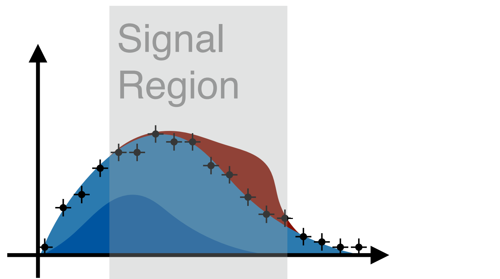
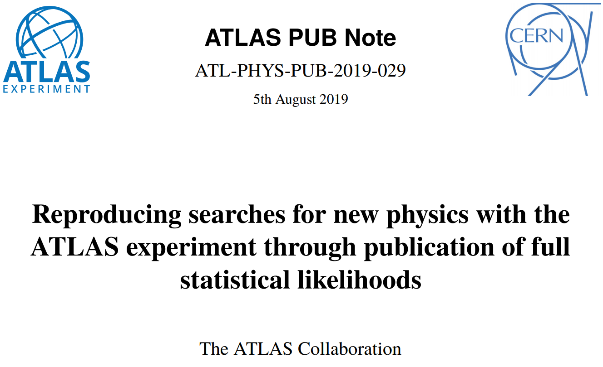

class: middle, center, title-slide
count: false

# Likelihood Publication and Preservation

 

.huge.blue[Matthew Feickert] 
.huge[(University of Illinois at Urbana-Champaign)]
.center.width-30[] 
 
[matthew.feickert@cern.ch](mailto:matthew.feickert@cern.ch)

[Snowmass 2021 Computational Frontier Workshop](https://indico.fnal.gov/event/43829/contributions/193820/)

August 10th, 2020

---
# Why is the likelihood important?

.kol-1-2.width-90[
 
- High information-density summary of analysis
- Almost everything we do in the analysis ultimately affects the likelihood and is encapsulated in it
   - Trigger
   - Detector
   - Systematic Uncertainties
   - Event Selection
- Unique representation of the analysis to preserve
]
.kol-1-2.width-100[
  

]

---
# Likelihood serialization...

.center[...making good on [19 year old agreement to publish likelihoods](https://indico.cern.ch/event/746178/contributions/3396797/)]

.center.width-90[

]

.center[([1st Workshop on Confidence Limits, CERN, 2000](http://inspirehep.net/record/534129))]

.bold[This hadn't been done in HEP until now]
- In an "open world" of statistics this is a difficult problem to solve
- What to preserve and how? All of ROOT?
- Idea: Focus on a single more tractable binned model first

---
# JSON spec fully describes the HistFactory model

.kol-1-4.width-100[
- Human & machine readable .bold[declarative] statistical models
- Industry standard
   - Will be with us forever
- Parsable by every language
   - Highly portable
   - No lock in
- Versionable and easily preserved
   - JSON Schema [describing  HistFactory specification](https://scikit-hep.org/pyhf/likelihood.html#bibliography)
   - Attractive for analysis preservation
   - Highly compressible
]
.kol-3-4.center[
.width-105[]

.center[[`JSON` defining a single channel, two bin counting experiment with systematics](https://scikit-hep.org/pyhf/likelihood.html#toy-example)]
]

---
# Publications using `pyhf` likelihoods

.kol-1-2.center.width-95[
.center.width-100[]

.center.width-100[]
]
.kol-1-2.center.width-100[
.center.width-100[]
]

---
# JSON Patch for signal model (reinterpretation)
<!--  -->
.center[JSON Patch gives ability to .bold[easily mutate model]]
.center[Combined with RECAST gives powerful tool for .bold[reinterpretation studies]]
 
.center[Think: test a .bold[new theory] with a .bold[new patch]!]
.center[(c.f. [Lukas's RECAST talk](https://indico.fnal.gov/event/43829/contributions/193817/))]
<!--  -->
.kol-1-5[
 
 
 
 
.center.width-100[]
.center[Signal model A]
]
.kol-3-5[
<!-- Using Perl style in Carbon -->
.center.width-100[]
]
.kol-1-5[
 
 
 
 
.center.width-100[]
.center[Signal model B]
]

---
# Likelihoods preserved on HEPData

- Background-only model JSON stored
- Hundreds of signal model JSON Patches stored together as a "patch set" file
- Together are able to publish and fully preserve the full likelihood (with own DOI! .width-20[] )

.kol-3-5[
[.center.width-100[]](https://www.hepdata.net/record/ins1755298?version=2)
]
.kol-2-5[
 
 
.center.width-100[]
]

---
# ...can be used from HEPData

- Background-only model JSON stored
- Hundreds of signal model JSON Patches stored together as a "patch set" file
- Together are able to publish and fully preserve the full likelihood (with own DOI! .width-20[] )

.center.width-90[]

---
# Rapid adoption in ATLAS...
<!--  -->
.kol-1-2[
- Four ATLAS analyses with full likelihoods published to HEPData
- ATLAS SUSY will be continuing to publish full Run 2 likelihoods
]
.kol-1-2[
- [doi:10.17182/hepdata.89408](https://doi.org/10.17182/hepdata.89408) (2019)
- [doi:10.17182/hepdata.91127](https://doi.org/10.17182/hepdata.91127) (2019)
- [doi:10.17182/hepdata.92006](https://doi.org/10.17182/hepdata.92006) (2019)
- [doi:10.17182/hepdata.90607.v2](https://doi.org/10.17182/hepdata.90607.v2) (2020)
]
.kol-1-1[
.kol-1-1[
.kol-1-2[
.center.width-70[]
]
.kol-1-2[
.center.width-70[]
]
]
.center.smaller[SUSY [EWK 3L RPV](https://atlas.cern/updates/physics-briefing/fantastic-decays-and-where-find-them) analysis ([ATLAS-CONF-2020-009](https://atlas.web.cern.ch/Atlas/GROUPS/PHYSICS/CONFNOTES/ATLAS-CONF-2020-009/)): Exclusion curves as a function of mass and branching fraction to $Z$ bosons]
]

---
# ...and by theory

.kol-2-5[
 

- [SModelS](https://smodels.github.io/) team has implemented a `SModelS`/`pyhf` interface
   - tool for interpreting simplified-model results from the LHC
   - designed to be used by theorists
- Have produced comparison for .italic[Search for direct stau production in events with two hadronic tau leptons in √s = 13 TeV pp collisions with the ATLAS detector] ([ATLAS-SUSY-2018-04](https://atlas.web.cern.ch/Atlas/GROUPS/PHYSICS/PAPERS/SUSY-2018-04/)) [published likelihood](https://www.hepdata.net/record/ins1765529)
   - Compare simplified likelihood (`SModelS`)
   - to full likelihood (`pyhf`)
]
.kol-3-5[
.center.width-100[]

.italic.smaller[
So here is one of our first reasonable validation plots.
It's preliminary, the black line is ATLAS-SUSY-2018-04 official exclusion curve.
The grey line is SModelS using `pyhf`, running over the published data. &mdash; Wolfgang Waltenberger, CMS/SModelS
]
]

---
# Summary
<!--  -->
- .bold[JSON specification] of `pyhf` likelihoods
   - human/machine readable, versionable, HEPData friendly, orders of magnitude smaller, long term preservation
- .bold[Bidirectional translation] of likelihood specifications
   - ROOT workspaces ↔ `pyhf` JSON
- Publication for the first time of the .bold[full likelihood] of a search for new physics
   - Continued publications from .bold[ATLAS SUSY full Run 2 results]
- .bold[Open publication] on HEPData, reuse and .bold[reinterpretation] with SModelS and RECAST

.kol-1-2.center.width-85[

([ATLAS, 2019](https://cds.cern.ch/record/2684863))
]
.kol-1-2.center.width-80[

(SModelS of [ATLAS-SUSY-2018-04](https://atlas.web.cern.ch/Atlas/GROUPS/PHYSICS/PAPERS/SUSY-2018-04/))
]

---
class: end-slide, center

.large[Backup]

---
# HistFactory Template

 

$$\begin{aligned}
&\mathcal{P}\left(n\_{c}, x\_{e}, a\_{p} \middle|\phi\_{p}, \alpha\_{p}, \gamma\_{b} \right) = \\\\
&{\color{blue}{\prod\_{c \\,\in\\, \textrm{channels}} \left[\textrm{Pois}\left(n\_{c} \middle| \nu\_{c}\right) \prod\_{e=1}^{n\_{c}} f\_{c}\left(x\_{e} \middle| \vec{\alpha}\right)\right]}} {\color{red}{G\left(L\_{0} \middle| \lambda, \Delta\_{L}\right) \prod\_{p\\, \in\\, \mathbb{S}+\Gamma} f\_{p}\left(a\_{p} \middle| \alpha\_{p}\right)}}
\end{aligned}$$

.bold[Use:] Multiple disjoint _channels_ (or regions) of binned distributions with multiple _samples_ contributing to each with additional (possibly shared) systematics between sample estimates

.bold[Main pieces:]

- .blue[Main Poisson p.d.f. for bins observed in all channels]
- .red[Constraint p.d.f. (+ data) for "auxiliary measurements"]
   - encoding systematic uncertainties (normalization, shape, etc)

---
# References

1. ROOT collaboration, K. Cranmer, G. Lewis, L. Moneta, A. Shibata and W. Verkerke, .italic[[HistFactory: A tool for creating statistical models for use with RooFit and RooStats](http://inspirehep.net/record/1236448)], 2012.
2. L. Heinrich, H. Schulz, J. Turner and Y. Zhou, .italic[[Constraining $A_{4}$ Leptonic Flavour Model Parameters at Colliders and Beyond](https://inspirehep.net/record/1698425)], 2018.

---

class: end-slide, center
count: false

The end.
